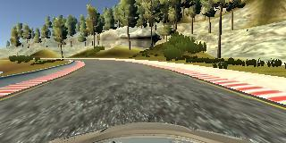
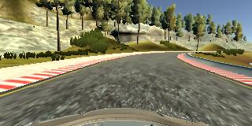

# Behavioral Cloning

[//]: # (Image References)

[image1]: ./writeup_img/screenshot.png
[image2]: ./writeup_img/nvidia_cnn.png
[image3]: ./writeup_img/model_shapes.png
[image4]: ./writeup_img/center.png
[image5]: ./writeup_img/left.png
[image6]: ./writeup_img/right.png
[image7]: ./writeup_img/curve.png
[image8]: ./writeup_img/mirror.png
[image9]: ./writeup_img/loss_epochs.png
[image10]: ./writeup_img/hist.png

![alt text][image1]

The object of this project was to apply deep learning principles to effectively teach a car to drive autonomously in a simulator. In training mode, the car drove around the test track and and training data was recorded. Then I use the captured data to train a convolutional neural network (CNN), which produces a model.

---
**Behavioral Cloning Project**

The goals / steps of this project are the following:
* Use the simulator to collect data of good driving behavior
* Build, a convolution neural network in Keras that predicts steering angles from images
* Train and validate the model with a training and validation set
* Test that the model successfully drives around track one without leaving the road
* Summarize the results with a written report


---
### Files Submitted & Code Quality

#### 1. Submission includes all required files and can be used to run the simulator in autonomous mode

My project includes the following files:
* model.py containing the script to create and train the model
* drive.py for driving the car in autonomous mode
* model.h5 containing a trained convolution neural network 
* README.md summarizing the results

#### 2. Submission includes functional code
Using the Udacity provided simulator and my drive.py file, the car can be driven autonomously around the track by executing 
```sh
python drive.py model.h5
```

#### 3. Submission code is usable and readable

The model.py file contains the code for training and saving the convolution neural network. The file shows the pipeline I used for training and validating the model, and it contains comments to explain how the code works.

### Model Architecture and Training Strategy

#### 1. An appropriate model architecture has been employed

My starting point was to implement model [NVIDIA CNN](https://images.nvidia.com/content/tegra/automotive/images/2016/solutions/pdf/end-to-end-dl-using-px.pdf)
![alt text][image2]

Then I added Dropout regularization after Flatten layer (model.py, line 118).
My model consists of a 3 convolution neural network with 5x5 filter sizes, 2 convolution neural network with 3x3 filter sizes and depths between 24 and 64 (model.py, lines 107-115) 

The model includes ELU layers to introduce nonlinearity (model.py lines 108-116), and the data is normalized in the model using a Keras lambda layer (model.py, line 106). 

#### 2. Attempts to reduce overfitting in the model

The model contains dropout layers in order to reduce overfitting (model.py lines 118). 

The model was trained and validated on different data sets to ensure that the model was not overfitting (model.py, 127,136). The model was tested by running it through the simulator and ensuring that the vehicle could stay on the track.

#### 3. Model parameter tuning

The model used an adam optimizer, so the learning rate was not tuned manually (model.py, line 135).

#### 4. Appropriate training data

Training data was chosen to keep the vehicle driving on the road. I used a combination of center lane driving, recovering from the left and right sides of the road. 

For details about how I created the training data, see the next section. 

---
### Model Architecture and Training Strategy

#### 1. Solution Design Approach

The overall strategy for deriving a model architecture was to pay attention on data quality. 

My first step was to use a convolution neural network model similar to the NVIDIA model. I thought this model might be appropriate because the NVIDIA team used this model for very similar task in behavioral cloning area.

In order to gauge how well the model was working, I split my image and steering angle data into a training and validation set. I found that my first model had a low mean squared error on the training set but a high mean squared error on the validation set. This implied that the model was overfitting. 

To combat the overfitting, I modified the model so that I added a dropput layer to model and ended up with trainig_loss = 0.0184 and validation_loss = 0.0180.

#### 2. Final Model Architecture

The final model architecture consisted of a convolution neural network with the following layers and layer sizes:
![alt text][image3]

#### 3. Creation of the Training Set & Training Process

To capture good driving behavior, I've downloaded already recorded data. Here is an example image of center, left and right lane driving:

Left| Center | Right
----|--------|-------
 |  | 

I didn't record the vehicle recovering from the left side and right sides of the road back to center so that the vehicle would learn to get back on track. I augmented the data instead. 
To augment the data sat, I flipped images and angles thinking that this would help to generalize the model and remove the bias of left curves. For example, here is an image that has then been flipped:

Original| Mirror | 
----|--------|
 |  | 


After the collection process, I had 37512 number of data points. I then preprocessed this data by converting its color from BGR to RGB. Then I cropped top and bottom parts of the images which contains needless information. After that, I resized images to the size of 66x200x3 on which NVIDIA model was trained.

This is distribution of steering angles across training data:
![alt text][image10]

I finally randomly shuffled the data set and put 20% of the data into a validation set. 

I used this training data for training the model. I used an adam optimizer so that manually training the learning rate wasn't necessary. The validation set helped determine if the model was over or under fitting. The ideal number of epochs was 3 as evidenced by the plot below.
![alt text][image9]

----
### Results
I trained the model on my local notebook with CPU. So I choose 5 epochs but the results were great - at the end of the process, the vehicle is able to drive autonomously around the track without leaving the road.

#### Training Track
[](https://www.youtube.com/watch?v=VOBAjDO9ChE)